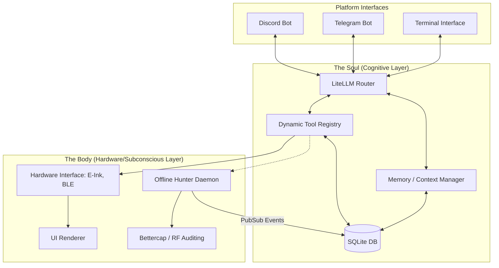

# 🦋 OpenClawGotchi V4 — Full Codebase Audit

## 1. High-Level Architecture (The Dual-Brain Paradigm)

OpenClawGotchi V4 operates on a sophisticated "Dual-Brain" architecture designed to separate heavy, blocking LLM cognition from real-time hardware orchestration.

---

## 2. Core Module Breakdown

- **`src/core/` (The Nervous System)**: Contains the LLM router, tool registry (`registry.py`), and vital connectors. It also houses the `events.py` PubSub bus and `cognitive_ingestor.py`, which are critical for bridging asynchronous hardware events (like returning from an offline hunt) back into the LLM's conversational context.
- **`src/hardware/` & `src/ui/` (The Physical Layer)**: Manages the Waveshare E-Ink display (`display.py` and `gotchi_ui.py`). Abstracted to handle physical rendering, Night Mode logic, and system vitals collection.
- **`src/memory/` (The Hippocampus)**: Manages active conversational context. It handles context-window flushing, LLM-based summarization of old messages, and semantic knowledge retrieval.
- **`src/db/` (The Long-Term Storage)**: Abstracted SQLite operations for both conversational history and the gamified stats engine.
- **`src/bot/` (The Translators)**: Contains the platform-specific event loops. `discord_bot.py`, `telegram.py`, and `handlers.py` connect the external world to the internal `router.py`.
- **`src/game_engine/` (The AIPet System)**: An isolated progression system that rewards tool usage, manages active missions, and updates virtual pet vitals (HP, XP, Level).
- **`src/extensions/` (The Appendages)**: The dynamically loaded skill folder. Any module here can export capabilities directly to the LLM.

---

## 3. Evaluation: Modularity & Separation of Concerns

### 🟢 Strengths
1. **Dynamic Tool Registry**: The `@register_tool` decorator implementation in `src/core/registry.py` is exceptionally modular. Adding a new capability requires zero modifications to the core parser. Furthermore, `src/core/cli/entry.py` automatically wraps these registered tools into executable CLI commands, ensuring perfect parity between what the AI can do and what a human operator can do.
2. **Event-Driven Subconscious**: The transition to `offline_hunter.py` functioning as a detached background daemon that communicates via `gotchi_states.json` and `events.emit` perfectly decouples the destructive networking tasks from the blocking LLM event loop.
3. **AIPet Isolation**: The gamification engine is cleanly abstracted into `src/game_engine/`, separating RPG mechanics from pure conversational logic.

### 🔴 Potential Issues (Tight Coupling)
1. **The Discord "God Class"**: `discord_bot.py` handles too many responsibilities. It manages WebSocket lifecycle, LLM message routing, status report generation, heartbeat pulsing, and dynamic awakening logic. It should ideally be stripped down to just a transport layer, handing events off to a unified `BotController`.
2. **UI Data Coupling**: `src/ui/gotchi_ui.py` directly imports `db.stats` and `src.game_engine.state` to render the footer. This binds the visual renderer directly to the database and game engine layers, making it harder to test the UI in isolation.
3. **Global State in Display Daemon**: `src/hardware/display.py` relies heavily on global variables (`_current_mood`, `_state_changed_event`) to manage the render thread.

---

## 4. Extensibility

The system is built for extreme extensibility:
- **Skill Injection**: Developers simply drop a Python script into `src/extensions/`.
- **Personality Hot-Swapping**: The `SOUL.md` and `.env` template architecture allows users to completely rewrite the bot's alignment without touching code.
- **API Agnostic**: `litellm_connector.py` abstracts the actual model provider, meaning the system can trivially swap between DeepSeek, OpenAI, Anthropic, or local Ollama models.

---

## 5. Resource Maintenance (Optimizations for Pi Zero 2W)

Running an LLM router, Discord WebSockets, SQLite I/O, Bettercap, and an E-Ink rendering thread concurrently on 512MB of RAM is challenging.

### Recommended Improvements:
1. **SQLite Write-Ahead Logging (WAL)**: The system writes to SQLite on almost every message/tool usage. Enabling WAL mode (`PRAGMA journal_mode=WAL;`) will significantly reduce disk I/O locks and SD card degradation.
2. **In-Memory Metric Buffering**: Instead of committing every +10 XP event to the database instantly, buffer XP/vitals changes in a lightweight dictionary and flush them to disk every 5 minutes.
3. **Subprocess Offloading for PCAPs**: Operations like `pwn_crack` (which parses heavy PCAP files) or file-system searches should be strictly sandboxed into temporary background `multiprocessing` workers rather than `asyncio.to_thread` to prevent the GIL from stalling the Discord heartbeat ping, which causes the bot to disconnect.
4. **Aggressive GC**: Implement an automated garbage collection call (`gc.collect()`) after large context flushes to prevent memory fragmentation over long uptimes.
