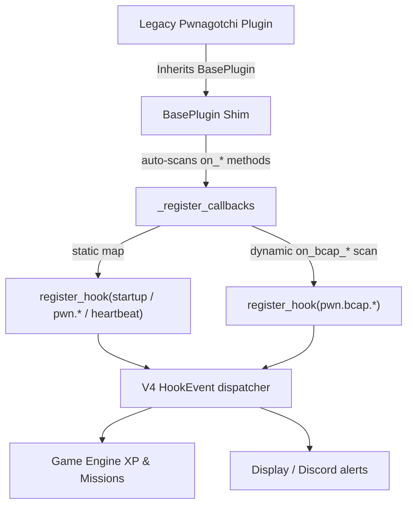

# 🦾 Pwnagotchi Plugins Integration

This document details the architectural blueprint, integration phases, and design
considerations for importing and adapting native Pwnagotchi plugins into the
modular, event-driven **OpenClawGotchi V4** codebase.

---

## 🧭 Architectural Strategy

Traditional Pwnagotchi plugins are built around a monolithic class-based lifecycle
(`BasePlugin`) that hooks directly into the host system. **OpenClawGotchi V4**
uses a **lightweight, async event-driven plugin system** powered by the `@hook`
decorator from `hooks.runner`.

To bridge both worlds without blocking the core AI daemon or exceeding the Pi
Zero 2W's 512 MB RAM budget, we translate legacy lifecycle callbacks into
**V4 hook events** through a compatibility shim (`src/pwnagotchi/plugins/__init__.py`).



---

## 🗂️ Complete Legacy Callback → V4 Event Mapping

| Legacy Callback | V4 Hook Event | `event.data` keys |
|:---|:---|:---|
| `on_loaded()` | `startup` | — |
| `on_ready(agent)` | `pwn.ready` | `agent` |
| `on_wifi_update(agent, aps)` | `pwn.wifi_update` | `agent`, `aps` |
| `on_handshake(agent, file, ap, cl)` | `pwn.handshake` | `agent`, `filename`, `ap`, `client` |
| `on_deauthentication(agent, ap, cl)` | `pwn.deauth` | `agent`, `ap`, `client` |
| `on_association(agent, ap)` | `pwn.association` | `agent`, `ap` |
| `on_epoch(agent, epoch, data)` | `pwn.epoch` | `agent`, `epoch`, `epoch_data` |
| `on_channel_hop(agent, ch)` | `pwn.channel_hop` | `agent`, `channel` |
| `on_internet_available(agent)` | `pwn.internet` | `agent` |
| `on_rebooting(agent)` | `pwn.rebooting` | — |
| `on_peer_detected(agent, peer)` | `pwn.peer_detected` | `agent`, `peer` |
| `on_periodic(agent)` | `heartbeat` | `agent` |
| `on_unload()` | `shutdown` | — |
| `on_bcap_*(agent, event)` | `pwn.bcap.<suffix>` | `agent`, `bcap_event` |

---

## 🛠️ Phase-by-Phase Integration Plan

```carousel
## Phase 1 ✅ Event Mapping Abstraction
**Goal**: Thin backward-compatible shim for legacy `BasePlugin` definitions.

**Delivered**:
- `src/pwnagotchi/plugins/__init__.py` — `BasePlugin` + `PluginLogAdapter`
- Auto-registration: static callbacks + dynamic `on_bcap_*` discovery
- Positional argument bridging via `_build_legacy_args()`
- TypeError fallback so plugins with non-standard signatures still fire
- First plugin: `plugins/rogue_ap_detector.py`
<!-- slide -->
## Phase 2 ✅ Active & Passive Plugin Integration
**Goal**: Full deauth/association tracking and passive network threat detection.

**Delivered**:
- `plugins/deauth_handler.py` — tracks deauths, associations, handshakes
- `plugins/network_auditor.py` — evil-twin + DNS spoof detector
- `plugins/rogue_ap_detector.py` v1.1 — active iwlist scanner, throttled
- BasePlugin extended with 7 new callback mappings + dynamic bcap dispatch
- All plugins: 100% syntax-clean (`py_compile` verified)
<!-- slide -->
## Phase 3 🔜 Game Engine & Mission Mapping
**Goal**: Wire all plugin events to the RPG leveling + mission system.

**Planned**:
- Add `Cyber Sentinel`, `Pwn Sniper`, `Field Agent`, `DNS Defender` missions to
  `workspace/missions/progressive.json`
- Validate XP flow: deauth → Handshake Hunter → complete_mission()
- E-ink kaomoji sync on alert face trigger
- End-to-end test harness: emit mock HookEvents, assert DB state changes
```

---

## 1. Phase 1: Event Mapping Abstraction ✅

Implemented in [`src/pwnagotchi/plugins/__init__.py`](file:///Users/js66/.gemini/antigravity-ide/scratch/openclawgotchi_V4/src/pwnagotchi/plugins/__init__.py).

### Key Design Decisions

- **`_STATIC_MAPPING`** class variable: exhaustive dict of all known legacy
  callback names → V4 event types. Subclasses only override what they implement.
- **`_build_legacy_args()`**: single dispatch function mapping `HookEvent.data`
  keys to the exact positional arg tuple each legacy signature expects.
- **Dynamic `on_bcap_*` discovery**: `dir(self)` scan at `__init__` time automatically
  registers any `on_bcap_<suffix>` method as `pwn.bcap.<suffix>` — future plugins
  using bettercap real-time events work with zero extra wiring.
- **TypeError fallback**: if positional arg mismatch occurs, the wrapper retries
  with the raw event, protecting against non-standard signatures.

---

## 2. Phase 2: Active & Passive Plugin Integration ✅

### Plugin Inventory

| File | Type | Hook Events | Missions |
|:---|:---|:---|:---|
| [`plugins/rogue_ap_detector.py`](file:///Users/js66/.gemini/antigravity-ide/scratch/openclawgotchi_V4/plugins/rogue_ap_detector.py) | Active (iwlist) | `pwn.wifi_update` | — |
| [`plugins/network_auditor.py`](file:///Users/js66/.gemini/antigravity-ide/scratch/openclawgotchi_V4/plugins/network_auditor.py) | Passive | `pwn.wifi_update`, `pwn.bcap.wifi_ap_new`, `pwn.dns_response`, `pwn.epoch` | Cyber Sentinel, DNS Defender |
| [`plugins/deauth_handler.py`](file:///Users/js66/.gemini/antigravity-ide/scratch/openclawgotchi_V4/plugins/deauth_handler.py) | Tracker | `pwn.deauth`, `pwn.association`, `pwn.handshake`, `pwn.epoch`, `pwn.bcap.wifi_ap_new`, `pwn.bcap.wifi_client_new` | Handshake Hunter, Pwn Sniper, Field Agent |

### `rogue_ap_detector.py` — Active Scanner (v1.1)

- Inherits `BasePlugin` (Phase 1 bridge)
- Active iwlist scan throttled to 1x per 60s to protect the radio
- Regex-based iwlist parser replaces fragile string splits
- Graceful fallback on `FileNotFoundError` (off-Pi dev mode)

### `network_auditor.py` — Passive Threat Detector

- **Evil-twin detection**: maintains `ssid → [bssid1, bssid2, ...]` rolling map
  across `pwn.wifi_update` and real-time `pwn.bcap.wifi_ap_new` events
- **Honeypot detection**: flags unknown APs with RSSI > -40 dBm
- **DNS anomaly detection**: `pwn.dns_response` hook (future scapy/bettercap
  integration) for untrusted-resolver and low-TTL flagging
- Per-SSID / per-MAC alert cooldown (5 min) prevents log spam
- Trusted resolver list auto-populated from `/etc/resolv.conf`

### `deauth_handler.py` — Attack Tracker

- Per-session rolling counters: deauths, associations, handshakes, channels hit
- Per-AP tracking dict with last-seen pruning at each `pwn.epoch`
- Summary log every 10 epochs
- Drives three AIPET missions via `increment_mission_progress()`

---

## 3. Phase 3: Game Engine & Mission Mapping 🔜

### New Missions to Add (`workspace/missions/progressive.json`)

```json
[
  {
    "name":       "Cyber Sentinel v1",
    "base_name":  "Cyber Sentinel",
    "category":   "security",
    "xp_reward":  100,
    "target":     5,
    "source":     "auto"
  },
  {
    "name":       "Pwn Sniper v1",
    "base_name":  "Pwn Sniper",
    "category":   "offensive",
    "xp_reward":  75,
    "target":     10,
    "source":     "auto"
  },
  {
    "name":       "Field Agent v1",
    "base_name":  "Field Agent",
    "category":   "offensive",
    "xp_reward":  50,
    "target":     20,
    "source":     "auto"
  },
  {
    "name":       "DNS Defender v1",
    "base_name":  "DNS Defender",
    "category":   "security",
    "xp_reward":  120,
    "target":     3,
    "source":     "auto"
  }
]
```

### RPG Telemetry Reward Table

| Plugin Trigger | Mission | XP | Display Face |
|:---|:---|:---|:---|
| Handshake captured | `Handshake Hunter` | +5 XP per capture | `(✪ ◡ ✪)` |
| Deauth fired | `Pwn Sniper` | per 10 | `(⌐■_■)` |
| Association sent | `Field Agent` | per 20 | `(๏ ◡ ๏)` |
| Evil-twin spotted | `Cyber Sentinel` | per 5 | `(▨ E ▨)` |
| DNS anomaly | `DNS Defender` | per 3 | `(╬ ಠ益ಠ)` |

---

## 🧪 Verification & Testing Plan

### Automated (Syntax)
```bash
cd /path/to/openclawgotchi_V4
python3 -m py_compile plugins/deauth_handler.py
python3 -m py_compile plugins/network_auditor.py
python3 -m py_compile plugins/rogue_ap_detector.py
python3 -m py_compile src/pwnagotchi/plugins/__init__.py
```
> ✅ All pass as of Phase 2 completion.

### Functional Simulation
```python
from hooks.runner import run_hook, HookEvent

# Simulate deauth event
event = HookEvent(
    event_type="pwn.deauth",
    data={
        "ap":     {"mac": "AA:BB:CC:DD:EE:FF", "hostname": "CoffeeShopAP", "channel": 6},
        "client": {"mac": "11:22:33:44:55:66", "vendor": "Apple"},
    }
)
run_hook(event)
# Expected: deauth counter incremented, Pwn Sniper mission progress +1

# Simulate evil-twin wifi_update
event2 = HookEvent(
    event_type="pwn.wifi_update",
    data={"aps": [
        {"mac": "AA:BB:CC:00:00:01", "hostname": "HomeNetwork", "channel": 1, "rssi": -65},
        {"mac": "AA:BB:CC:00:00:02", "hostname": "HomeNetwork", "channel": 6, "rssi": -60},
    ]}
)
run_hook(event2)
# Expected: evil-twin warning logged, Cyber Sentinel mission progress +1
```

### Pi Deployment Check
- Monitor RAM with `gotchi dash` — target: < 400 MB under all three plugins loaded
- Confirm iwlist throttle prevents radio saturation during AP updates
- Verify Discord webhook fires on first Handshake Hunter mission completion
